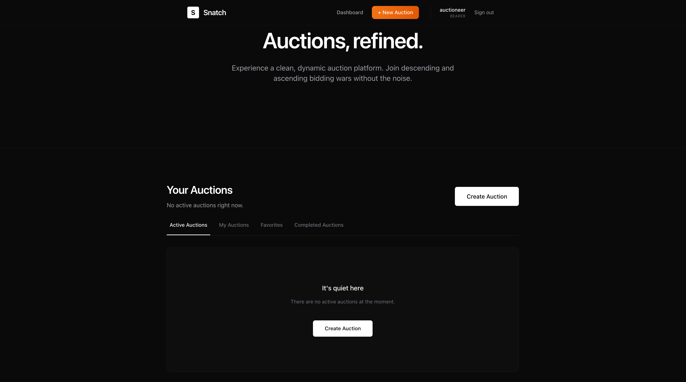
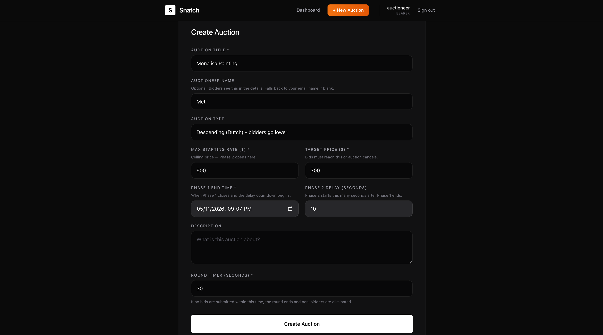
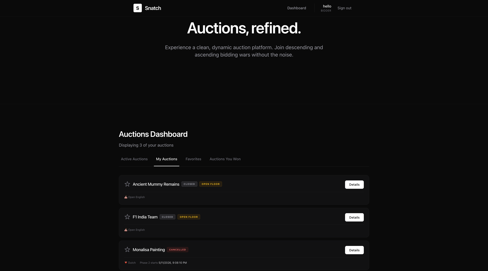
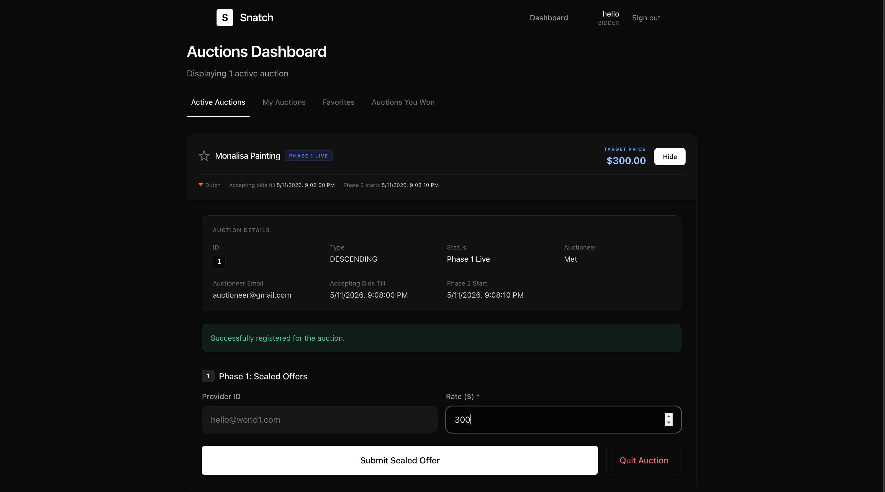
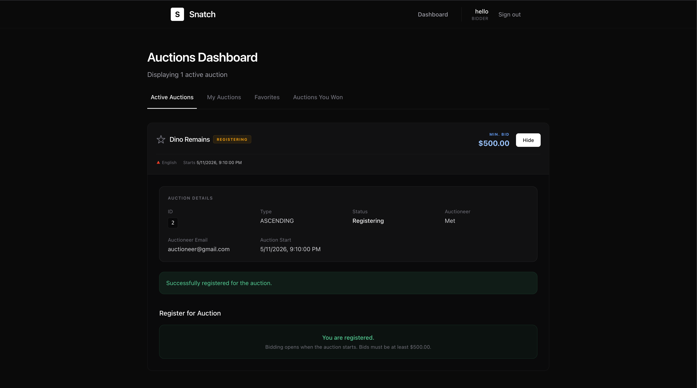
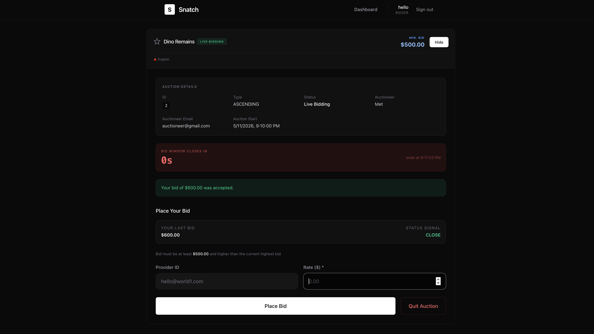
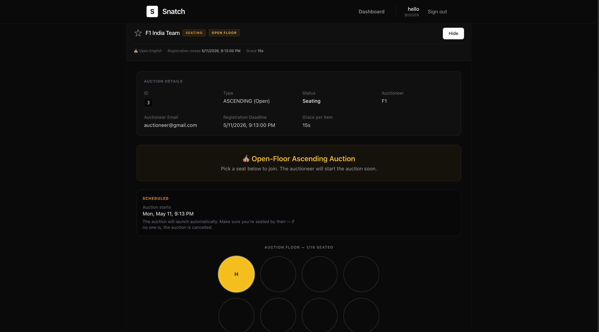
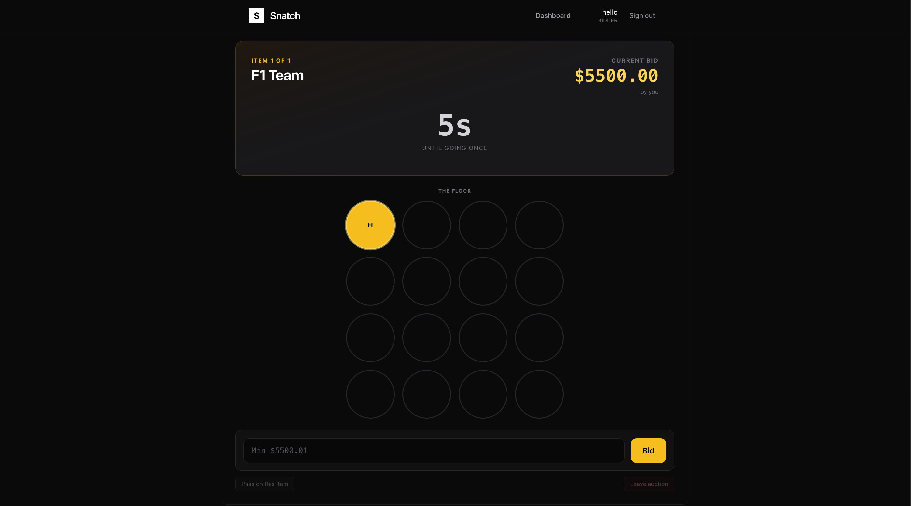
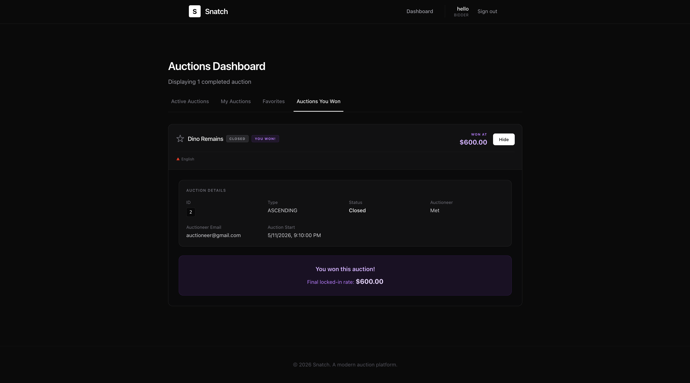

# Snatch

A real-time, multi-phase auction platform supporting descending (Dutch) and ascending (English) auction mechanics with round-based elimination.

---

## Contributors

- Akarsh Malik
- Hashmmath Shaik
---



















## System Architecture

```
┌───────────────────────────────────────────────────────────┐
│                      Browser (Client)                     │
│                                                           │
│   Next.js 16 + React 19 + Tailwind CSS                    │
│   ├── HTTP REST  ──────────────────────────────────────►  │
│   └── WebSocket (STOMP over SockJS)  ──────────────────►  │
└──────────────────────────┬────────────────────────────────┘
                           │ :3000
                           ▼
┌─────────────────────────────────────────────────────────────────┐
│                  Spring Boot API (Java 25)                      │
│                                                                 │
│   Controllers (REST)                                            │
│   ├── EngagementController   /api/engagements                   │
│   ├── SubmissionController   /api/engagements/:id/*             │
│   └── UserController         /api/users                         │
│                                                                 │
│   Services (Strategy Pattern)                                   │
│   ├── DescendingAuctionService  -  Dutch auction logic          │
│   ├── AscendingAuctionService   -  Closed English auction logic │
│   └── OpenAscendingAuctionService - Open English auction logic  │
│                                                                 │
│   WebSocket                                                     │
│   ├── /topic/engagements/:id/status  -  phase events            │
│   └── /topic/engagements/:id         -  live rate updates       │
│                                                                 │
│   Scheduler                                                     │
│   └── AuctionScheduler  -  auto-transition auctions:            │
│       • CLOSED (PHASE_1_SEALED for Descending, PENDING for      │
│          Ascending + phase2StartTime past) → PHASE_2_LIVE       │
│       • OPEN (PENDING + openStartTime past) → auto-start        │
└──────────────────────────┬──────────────────────────────────────┘
                           │ :8080
                           ▼
┌──────────────────────────────────────────────────────────┐
│               PostgreSQL 16 (snatch_db)                  │
│                                                          │
│   Tables: users, engagements, submissions, registrations │
└──────────────────────────────────────────────────────────┘
```

---

## Auction Mechanics

### Auction Formats

**Closed Auctions** (single winner for the entire auction)
- **Descending (Dutch) Auction**: Two-phase structure with sealed bids followed by live round-based elimination.
- **Ascending (English) Auction**: Single-phase live bidding starting from a base rate, with bids increasing until the target price is met or time expires.

**Open Auctions** (multiple items, multiple winners)
- **Ascending (English) Auction**: Single-phase live bidding per item, with items auctioned sequentially in real-time.

### Two-Phase Structure (Descending Auctions Only)

**Phase 1 - Sealed Bids**
- Bidders register and submit sealed offers blindly (no visibility into other bids)
- The auctioneer sets a Phase 1 deadline; no bids are accepted after it expires
- The auctioneer manually triggers the transition to Phase 2

**Phase 2 - Live Round-Based Bidding**
- A countdown timer runs for each round (configurable, default 30s)
- Each bidder submits their own rate independently; their bid must beat their own previous bid
- Only the best bid across all bidders updates the global live rate
- Bidders see a signal (CLOSE / MID / FAR) indicating how competitive they are
- When the round timer expires:
  - **0 bids submitted** → auction closes
  - **1+ bids submitted** → non-bidders are eliminated; a new round starts
- Bidders can quit at any time; the auction ends only when all bidders have quit

### Single-Phase Live Bidding (Ascending Auctions)

- Auction starts immediately after registration period (for Closed) or at scheduled time (for Open)
- Bidders place live bids in real-time
- For Closed Ascending: Bids must be higher than the current rate; auction ends when target price is met or time expires
- For Open Ascending: Items are auctioned sequentially; each item has a grace period for first bid, then live bidding with silence resets

### Descending (Dutch) Auction
- Starting rate = `min(maxStartingRate, lowestPhase1Bid)`
- Phase 2 bids must be strictly lower than the bidder's own last bid
- Winner = bidder with the lowest final rate when the auction closes

### Ascending (English) Auction
- **Closed Format**: Starting rate set by auctioneer; bids increase until target price is met
- **Open Format**: Per-item bidding with configurable grace periods and silence resets
- Winner(s) = bidder(s) with the highest final rate(s) meeting reserve prices

---

## Core Java Features

### Concurrency
- **`ScheduledExecutorService`** - per-auction countdown timers for Phase 2 rounds, scheduled independently so auctions don't block each other
- **`ConcurrentHashMap`** - thread-safe in-memory state for active bidders, round participants, and scheduled timers
- **`ConcurrentHashMap.newKeySet()`** - lock-free concurrent `Set` for per-round bidder tracking
- **Pessimistic Locking** - `@Lock(LockModeType.PESSIMISTIC_WRITE)` on the engagement fetch inside `processLiveRate`, preventing race conditions when multiple bidders submit simultaneously

### Design Patterns
- **Strategy Pattern** - `AuctionEngine` interface implemented by `DescendingAuctionService` and `AscendingAuctionService`; the controller resolves the correct engine at runtime based on auction type
- **Dependency Injection with `@Qualifier`** - both engines are Spring beans; `@Qualifier("descendingEngine")` / `@Qualifier("ascendingEngine")` disambiguates injection

### Spring Framework
- **Spring WebSocket + STOMP** - `SimpMessagingTemplate.convertAndSend()` broadcasts real-time events (phase transitions, rate updates, round starts, auction close) to all connected subscribers
- **`@Transactional`** - ensures bid saves and live rate updates are atomic; rolled back on failure
- **`@Scheduled`** - `AuctionScheduler` polls every 5 seconds to auto-transition auctions whose `phase2StartTime` has elapsed
- **Spring Data JPA** - repository pattern with derived query methods and custom `@Query` annotations

### Security
- **BCrypt** (jbcrypt) - passwords are hashed with `BCrypt.hashpw()` at registration and verified with `BCrypt.checkpw()` at login; plaintext passwords are never stored

### Data Access
- **Hibernate + PostgreSQL dialect** - JPA entities mapped to tables with `@Entity`, `@ManyToOne`, `@Enumerated`
- **Lombok `@Data`** - auto-generates getters, setters, `equals`, `hashCode`, and `toString` at compile time via annotation processing

---

## Tech Stack

| Layer | Technology |
|---|---|
| Frontend | Next.js 16, React 19, TypeScript, Tailwind CSS v4 |
| Backend | Spring Boot 4.0.5, Java 25 |
| WebSocket | STOMP over SockJS (`@stomp/stompjs`) |
| Database | PostgreSQL 16 |
| ORM | Hibernate / Spring Data JPA |
| Auth | BCrypt password hashing |
| Build | Maven (Spring Boot Maven Plugin) |
| Container | Docker, Docker Compose |

---

## Configuration — `.env`

All database credentials live in a single `.env` file at the project root. Both `docker-compose.yml` (which reads it automatically) and the Spring Boot app (via environment variable placeholders) use the same values.

**Setup:**

```bash
cp .env.example .env
```

Then edit `.env` to set your credentials:

```env
DB_NAME=DB_NAME
DB_USER=DB_USER
DB_PASSWORD=DB_PASSWORD
```

> `.env` is gitignored. Never commit it. Commit `.env.example` instead (already included).

**How the values flow:**

| Variable | Used by |
|---|---|
| `DB_NAME` | PostgreSQL container (`POSTGRES_DB`) + Spring Boot (`spring.datasource.url`) |
| `DB_USER` | PostgreSQL container (`POSTGRES_USER`) + Spring Boot (`spring.datasource.username`) |
| `DB_PASSWORD` | PostgreSQL container (`POSTGRES_PASSWORD`) + Spring Boot (`spring.datasource.password`) |

Spring Boot reads these via placeholders in `application.properties`:
```properties
spring.datasource.url=jdbc:postgresql://${DB_HOST:localhost}:5432/${DB_NAME:snatch_db}
spring.datasource.username=${DB_USER:root}
spring.datasource.password=${DB_PASSWORD:snatch_it}
```

The `DB_HOST` variable is set to `postgres` (the Docker service name) by `docker-compose.yml` for containerised runs, and defaults to `localhost` for local development.

---

## Running with Docker (Recommended)

> Requires Docker and Docker Compose v2.

```bash
# Clone the repo
git clone https://github.com/malikakarsh/Snatch.git
cd Snatch

# Configure credentials
cp .env.example .env
# Edit .env if you want non-default values

# Build and start all three services
docker-compose up -d

# View logs
docker-compose logs -f

# Stop everything
docker-compose down

# Stop and remove the database volume (full reset)
docker-compose down -v
```

| Service | URL |
|---|---|
| Frontend | http://localhost:3000 |
| API | http://localhost:8080 |
| PostgreSQL | localhost:5432 |

> The first build takes a few minutes — Maven downloads dependencies and Next.js compiles the app. Subsequent builds are faster due to Docker layer caching.

---

## Running Locally (Development)

### Prerequisites
- Java 25
- Node.js 22+
- PostgreSQL 16 running locally on port 5432

### 1. Configure credentials

```bash
cp .env.example .env
# Edit .env with your local Postgres credentials if different from defaults
```

The Spring Boot app reads `DB_NAME`, `DB_USER`, and `DB_PASSWORD` directly from the environment, with defaults matching `.env.example`. For local dev you can either:

- Export them in your shell: `export $(cat .env | xargs)`
- Or leave the defaults as-is (`snatch_db` / `root` / `snatch_it`) and create a matching Postgres user

### 2. Start PostgreSQL

Create the database and user to match your `.env`:

```sql
CREATE USER root WITH PASSWORD 'snatch_it';
CREATE DATABASE snatch_db OWNER root;
```

### 3. Start the API

```bash
cd api
./mvnw spring-boot:run
```

API is available at `http://localhost:8080`.

### 4. Start the frontend

```bash
cd client
npm install
npm run dev
```

Frontend is available at `http://localhost:3000`.

---

## Project Structure

```
Snatch/
├── api/                          # Spring Boot backend
│   ├── src/main/java/com/snatch/api/
│   │   ├── config/               # WebSocket, CORS config
│   │   ├── controllers/          # REST endpoints
│   │   ├── models/               # JPA entities
│   │   ├── repositories/         # Spring Data JPA repos
│   │   └── services/             # Auction engines + scheduler
│   │       ├── AuctionScheduler.java
│   │       ├── DescendingAuctionService.java
│   │       ├── AscendingAuctionService.java
│   │       └── OpenAscendingAuctionService.java
│   ├── src/main/resources/
│   │   └── application.properties  # All config via env vars
│   ├── Dockerfile
│   └── pom.xml
├── client/                       # Next.js frontend
│   ├── app/
│   │   ├── components/           # AuctionCard, OfferForm, AuthProvider
│   │   ├── login/
│   │   ├── register/
│   │   └── page.tsx              # Main dashboard
│   ├── lib/api.ts                # Typed API client
│   ├── Dockerfile
│   └── package.json
├── .env                          # Local credentials (gitignored)
├── .env.example                  # Template to copy from
├── docker-compose.yml
└── README.md
```

---

## API Reference

### Users
| Method | Endpoint | Description |
|---|---|---|
| POST | `/api/users/register` | Register with email, password, role |
| POST | `/api/users/login` | Login, returns user object |

### Engagements (Auctions)
| Method | Endpoint | Description |
|---|---|---|
| GET | `/api/engagements` | List all auctions |
| POST | `/api/engagements` | Create auction (BEARER only) |
| POST | `/api/engagements/:id/register` | Register as bidder |
| POST | `/api/engagements/:id/sealed-offers` | Submit Phase 1 bid |
| POST | `/api/engagements/:id/transition` | Start Phase 2 (BEARER only) |
| POST | `/api/engagements/:id/live-offers` | Submit Phase 2 bid |
| POST | `/api/engagements/:id/quit` | Withdraw from auction |
| GET | `/api/engagements/:id/my-status` | Get bidder's own status + signal |

### WebSocket Topics
| Topic | Event |
|---|---|
| `/topic/engagements/:id/status` | `PHASE_2_LIVE`, `ROUND_START`, `CLOSED`, `CANCELLED` |
| `/topic/engagements/:id` | Live rate update `{ currentLiveRate }` |
